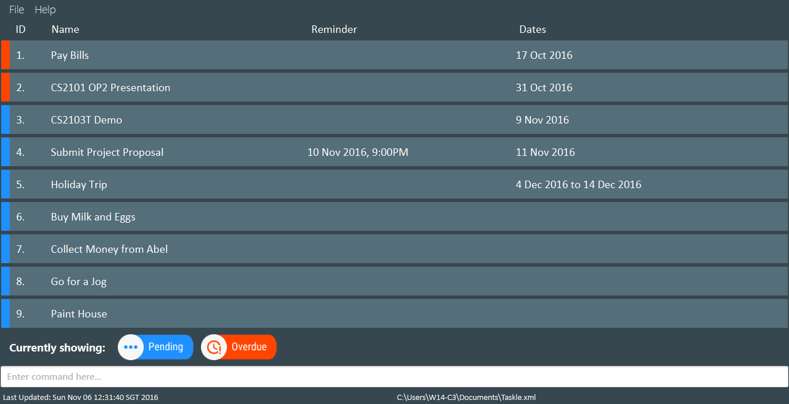

# Taskle

 

* It is a task management application with a single text box for the input of commands. It has a GUI but most of the user interactions happen using a CLI (Command Line Interface).
* It is intended to help users to keep track of their tasks efficiently.

  
#### Site Map
* [User Guide](docs/UserGuide.md) 
* [Developer Guide](docs/DeveloperGuide.md) 
* [Learning Outcomes](docs/LearningOutcomes.md) 
* [About Us](docs/AboutUs.md)
* [Contact Us](docs/ContactUs.md)

#### Acknowledgements

* Some parts of this sample application were inspired by the excellent 
  [Java FX tutorial](http://code.makery.ch/library/javafx-8-tutorial/) by *Marco Jakob*. 

* The sample project was created by [SE-EDU initiative](https://github.com/se-edu/)

* This project utilizes the [Natty Date Parser](http://natty.joestelmach.com/) library for parsing date and times

#### Licence : [MIT](LICENSE)
