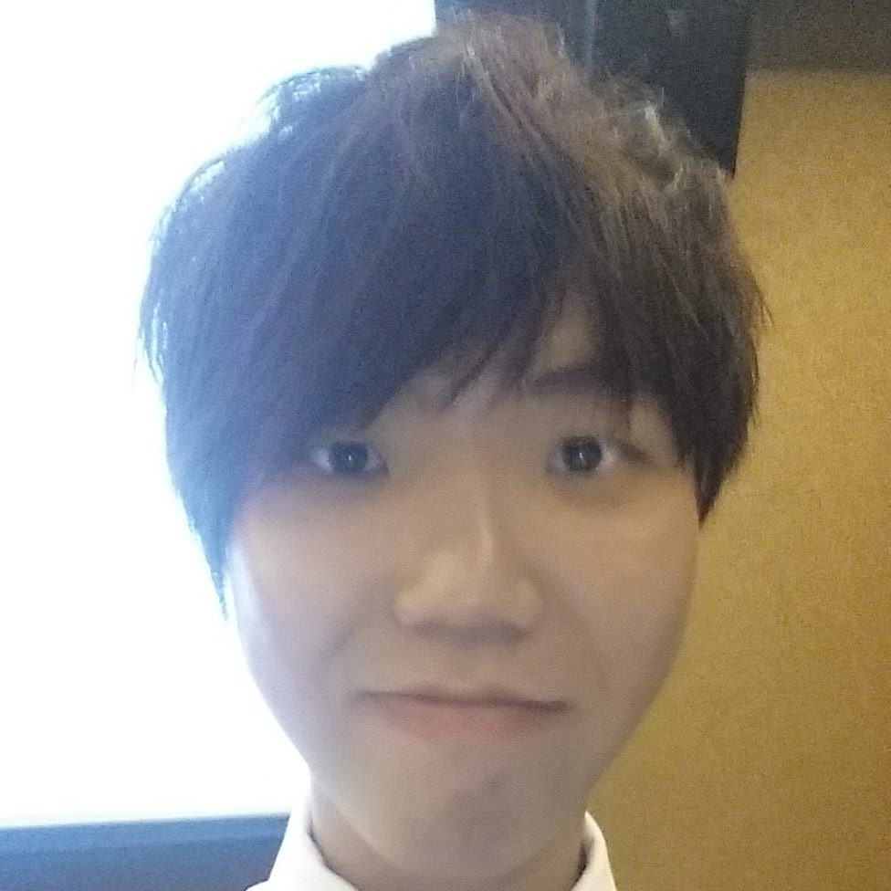

<!-- @@author A0141780J-->

# About Us

We are from team W14-C3. 

## Project Team

#### [Abel Lim](http://github.com/abellimz)  
 
* Role: Team Lead  
* Components in charge of: Logic  
* Aspects/tools in charge of: Git, Scheduling & Tracking  
* Features implemented: 
	* [Adding events](https://github.com/CS2103AUG2016-W14-C3/main/blob/master/docs/UserGuide.md#add-a-task--event-add)
	* [Adding deadlines](https://github.com/CS2103AUG2016-W14-C3/main/blob/master/docs/UserGuide.md#add-a-task--event-add)
	* [Finding tasks by keywords and statuses](https://github.com/CS2103AUG2016-W14-C3/main/blob/master/docs/UserGuide.md#finding-a-task--find)
	* [Listing tasks by keywords and statuses](https://github.com/CS2103AUG2016-W14-C3/main/blob/master/docs/UserGuide.md#listing-tasks-list)
* Code written: 
	* [[Functional Code](https://github.com/CS2103AUG2016-W14-C3/main/blob/master/collated/main/A0141780J.md)]
	* [[Test code](https://github.com/CS2103AUG2016-W14-C3/main/blob/master/collated/test/A0141780J.md)]
	* [[Docs](https://github.com/CS2103AUG2016-W14-C3/main/blob/master/collated/docs/A0141780J.md)]

-----

#### [Ong Zhi Yong](http://github.com/zhiyong4113)
 
* Role: Quality Assurance, Deliverables & Deadlines  
* Components in charge of: Storage
* Aspects/tools in charge of: Travis CI, Testing
* Features implemented: 
	* [Editing task](https://github.com/CS2103AUG2016-W14-C3/main/blob/master/docs/UserGuide.md#edit-a-task--edit-reschedule-remind)
	* [Reschedule task](https://github.com/CS2103AUG2016-W14-C3/main/blob/master/docs/UserGuide.md#edit-a-task--edit-reschedule-remind)
	* [Setting reminders](https://github.com/CS2103AUG2016-W14-C3/main/blob/master/docs/UserGuide.md#edit-a-task--edit-reschedule-remind)
* Code written: 
	* [[Functional Code](https://github.com/CS2103AUG2016-W14-C3/main/blob/master/collated/main/A0139402M.md)]
	* [[Test code](https://github.com/CS2103AUG2016-W14-C3/main/blob/master/collated/test/A0139402M.md)]
	* [[Docs](https://github.com/CS2103AUG2016-W14-C3/main/blob/master/collated/docs/A0139402M.md)]

-----

#### [Hamsyari](http://github.com/hamsyari) 
 
* Role: Code Quality & Documentation 
* Components in charge of: Model
* Aspects/tools in charge of: Code review, documentation content.
* Features implemented:
	* [Undo command](https://github.com/CS2103AUG2016-W14-C3/main/blob/master/docs/UserGuide.md#undoing-a-recent-command-undo)
	* [Redo command](https://github.com/CS2103AUG2016-W14-C3/main/blob/master/docs/UserGuide.md#undoing-a-recent-command-redo)
	* Setting save file directory
* Code written: 
	* [[Functional Code](https://github.com/CS2103AUG2016-W14-C3/main/blob/master/collated/main/A0140047U.md)]
	* [[Test code](https://github.com/CS2103AUG2016-W14-C3/main/blob/master/collated/test/A0140047U.md)]
	* [[Docs](https://github.com/CS2103AUG2016-W14-C3/main/blob/master/collated/docs/A0140047U.md)]

-----

#### [Silfer Goh](http://github.com/Silfer)
 
* Role: GUI Design  
* Components in charge of: UI and Main
* Aspects/tools in charge of: UI mockups and design
* Features implemented:
	* [Mark task as done](https://github.com/CS2103AUG2016-W14-C3/main/blob/master/docs/UserGuide.md#mark-a-task-as-done-done)
	* [Multiple removal of tasks](https://github.com/CS2103AUG2016-W14-C3/main/blob/master/docs/UserGuide.md#remove-a-task-remove)
* Code written: 
	* [[Functional Code](https://github.com/CS2103AUG2016-W14-C3/main/blob/master/collated/main/A0125509H.md)]
	* [[Test code](https://github.com/CS2103AUG2016-W14-C3/main/blob/master/collated/test/A0125509H.md)]
	* [[Docs](https://github.com/CS2103AUG2016-W14-C3/main/blob/master/collated/docs/A0125509H.md)]

-----

#### [Michelle Tan](http://github.com/michelletan)  
 
Role: Mentor    

-----