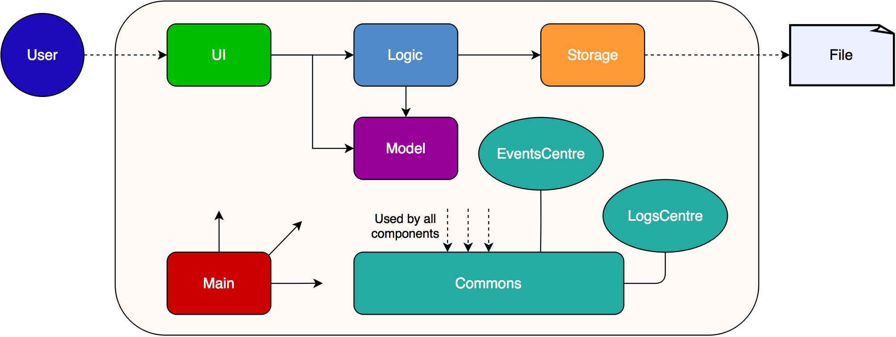
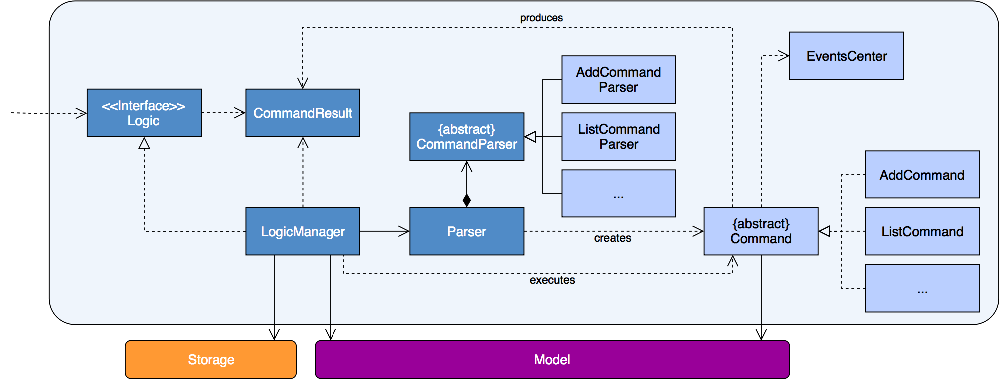
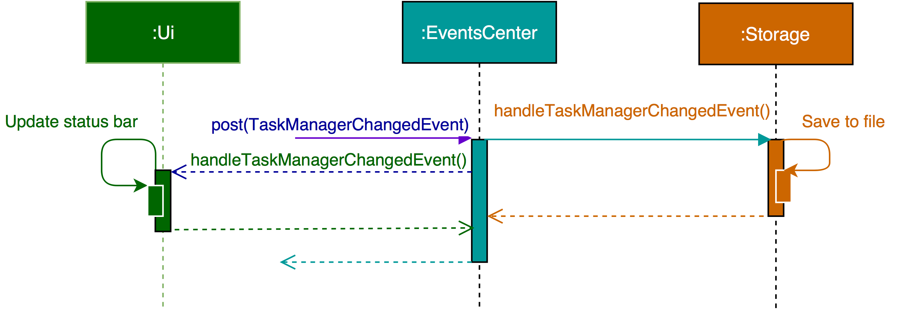
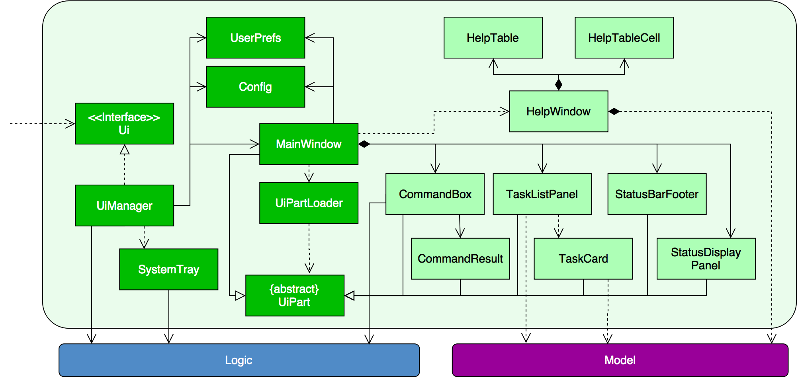
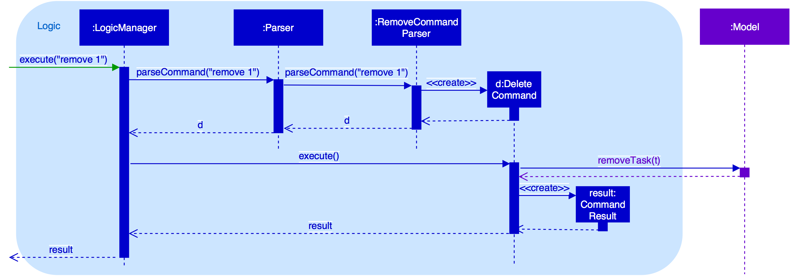
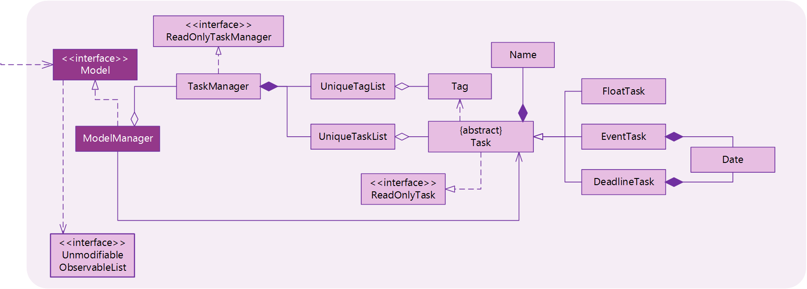

# Taskle Developer Guide 

<!-- @@author A0125509H -->

## Introduction
Taskle is a task management application that helps users keep track of their tasks efficiently.  It comprises a Command Line Interface (CLI) for the input of all commands and a GUI for the output.  

This guide describes the design and implementation of Taskle. It will help you understand how Taskle works and how you can further contribute to its development. We have organised this guide in a top-down manner so that you can understand the big picture before moving on to the more detailed sections.
  
## Table of Contents
* [Setting Up](#setting-up)
* [Design](#design)
* [Implementation](#implementation)
* [Testing](#testing)
* [Dev Ops](#dev-ops)
* [Appendix A: User Stories](#appendix-a--user-stories)
* [Appendix B: Use Cases](#appendix-b--use-cases)
* [Appendix C: Non Functional Requirements](#appendix-c--non-functional-requirements)
* [Appendix D: Glossary](#appendix-d--glossary)
* [Appendix E : Product Survey](#appendix-e--product-survey)

<!-- @@author A0141780J -->

## Setting up

#### Prerequisites

1. **JDK `1.8.0_60`**  or later 

    > Having any Java 8 version is not enough.  
    This app will not work with earlier versions of Java 8.
    
2. **Eclipse** IDE
3. **e(fx)clipse** plugin for Eclipse (Do the steps 2 onwards given in
   [this page](http://www.eclipse.org/efxclipse/install.html#for-the-ambitious))
4. **Buildship Gradle Integration** plugin from the Eclipse Marketplace

#### Importing the project into Eclipse

0. Fork this repo, and clone the fork to your computer
1. Open Eclipse (Note: Ensure you have installed the **e(fx)clipse** and **buildship** plugins as given 
   in the prerequisites above)
2. Click `File` > `Import`
3. Click `Gradle` > `Gradle Project` > `Next` > `Next`
4. Click `Browse`, then locate the project's directory
5. Click `Finish`

  > * If you are asked whether to 'keep' or 'overwrite' config files, choose to 'keep'.
  > * Depending on your connection speed and server load, it can even take up to 30 minutes for the set up to finish
      (This is because Gradle downloads library files from servers during the project set up process)
  > * If Eclipse auto-changed any settings files during the import process, you can discard those changes.

## Design

### Architecture

Figure 1: Architecture Diagram
 
The **_Architecture Diagram_** given above explains the high-level design of the App.
Given below is a quick overview of each component.

`Main` has only one class called [`MainApp`](../src/main/java/taskle/MainApp.java). It is responsible for:
* At app launch: Initializes the components in the correct sequence, and connect them up with each other.
* At shut down: Shuts down the components and invoke cleanup method where necessary.

[**`Commons`**](#common-classes) represents a collection of classes used by multiple other components.
Two of those classes play important roles at the architecture level.
* `EventsCentre` : This class (written using [Google's Event Bus library](https://github.com/google/guava/wiki/EventBusExplained))
  is used by components to communicate with other components using events (i.e. a form of _Event Driven_ design)
* `LogsCenter` : Used by many classes to write log messages to the App's log file.

The rest of the App consists four components.
* [**`UI`**](#ui-component) : The UI of the App.
* [**`Logic`**](#logic-component) : The command executor.
* [**`Model`**](#model-component) : Holds the data of the App in-memory.
* [**`Storage`**](#storage-component) : Reads data from, and writes data to, the hard disk.

Each of the four components:
* Defines its _API_ in an `interface` with the same name as the Component.
* Exposes its functionality using a `{Component Name}Manager` class.

For example, the `Logic` component (see the class diagram given below) defines it's API in the `Logic.java`
interface and exposes its functionality using the `LogicManager.java` class.  

Figure 2: Logic Class Diagram Example
  

The _Sequence Diagram_ below shows how the components interact for the scenario where the user issues the
command `remove 1`. 

Figure 3: Sequence Diagram for Delete Person
 

>Note how the `Model` simply raises a `TaskManagerChangedEvent` when the Task Manager data are changed,
 instead of asking the `Storage` to save the updates to the hard disk.

 
The diagram below shows how the `EventsCenter` reacts to that event, which eventually results in the updates
being saved to the hard disk and the status bar of the UI being updated to reflect the 'Last Updated' time.   

Figure 4: Sequence Diagram for Handling of Events
 

> Note how the event is propagated through the `EventsCenter` to the `Storage` and `UI` without `Model` having
  to be coupled to either of them. This is an example of how this Event Driven approach helps us reduce direct 
  coupling between components.

 
The sections below give more details of each component.

<!-- @@author A0125509H -->

### UI component

Figure 5: User Interface Class Diagram
 

**API** : [`Ui.java`](../src/main/taskle/ui/Ui.java)

The UI consists of a `MainWindow` that is made up of parts e.g.`CommandBox`, `ResultDisplay`, `TaskListPanel`,
`StatusBarFooter` and `TaskCard`. All these, including the `MainWindow`, inherit from the abstract `UiPart` class
and they can be loaded using the `UiPartLoader`.

The `UI` component uses JavaFx UI framework. The layout of these UI parts are defined in matching `.fxml` files
 that are in the `src/main/resources/view` folder. 
 For example, the layout of the [`MainWindow`](../src/main/java/taskle/ui/MainWindow.java) is specified in
 [`MainWindow.fxml`](../src/main/resources/view/MainWindow.fxml)

The `UI` component:
* Executes user commands using the `Logic` component.
* Binds itself to some data in the `Model` so that the UI can auto-update when data in the `Model` change.
* Responds to events raised from various parts of the App and updates the UI accordingly.

<!-- @@author A0141780J -->

### Logic component

Figure 6: Logic Class Diagram
 

**API** : [`Logic.java`](../src/main/taskle/logic/Logic.java)

1. `Logic` uses the `Parser` class to parse the user command.
2. `History` saves the commands that `LogicManager` executes.
3. `Parser` uses the CommandParser classes to parse the command.
4. It returns a `Command` object which is executed by the `LogicManager`.
5. The command execution can affect the `Model` (e.g. adding a task) and/or raise events.
6. The result of the command execution is encapsulated as a `CommandResult` object which is passed back to the `Ui`.

Given below is the Sequence Diagram for interactions within the `Logic` component for the `execute("remove 1")` API call.  

Figure 7: Delete Person Logic Sequence Diagram
 

<!-- @@author A0140047U -->

### Model component

Figure 8: Model Class Diagram
 

**API** : [`Model.java`](../src/main/taskle/model/Model.java)

The `Model`:
* Stores a `UserPref` object that represents the user's preferences.
* Stores the Task Manager data.
* Exposes a `UnmodifiableObservableList<ReadOnlyTask>` that can be 'observed' e.g. the UI can be bound to this list
  so that the UI automatically updates when the data in the list change.
* Does not depend on any of the other three components.

<!-- @@author A0139402M -->

### Storage component

Figure 9: Storage Class Diagram
 

**API** : [`Storage.java`](../src/main/taskle/storage/Storage.java)

The `Storage` component:
* Can save `UserPref` objects in json format and read it back.
* Can save the Task Manager data in xml format and read it back.

<!-- @@author -->

### Common classes

Classes used by multiple components are in the `taskle.commons` package.

## Implementation

### Logging

We are using `java.util.logging` package for logging. The `LogsCenter` class is used to manage the logging levels
and logging destinations.

* The logging level can be controlled using the `logLevel` setting in the configuration file
  (See [Configuration](#configuration))
* The `Logger` for a class can be obtained using `LogsCenter.getLogger(Class)` which will log messages according to
  the specified logging level
* Currently log messages are output through: `Console` and to a `.log` file.

**Logging Levels**

* `SEVERE` : Critical problem detected which may possibly cause the termination of the application
* `WARNING` : Can continue, but with caution
* `INFO` : Information showing the noteworthy actions by the App
* `FINE` : Details that is not usually noteworthy but may be useful in debugging
  e.g. print the actual list instead of just its size

### Configuration

Certain properties of the application can be controlled (e.g App name, logging level) through the configuration file 
(default: `config.json`):

## Testing

Tests can be found in the `./src/test/java` folder.

**In Eclipse**:
> If you are not using a recent Eclipse version (i.e. _Neon_ or later), enable assertions in JUnit tests
  as described [here](http://stackoverflow.com/questions/2522897/eclipse-junit-ea-vm-option).

* To run all tests, right-click on the `src/test/java` folder and choose
  `Run as` > `JUnit Test`
* To run a subset of tests, you can right-click on a test package, test class, or a test and choose
  to run as a JUnit test.

**Using Gradle**:
* See [UsingGradle.md](UsingGradle.md) for how to run tests using Gradle.

We have two types of tests:

1. **GUI Tests** - These are _System Tests_ that test the entire App by simulating user actions on the GUI. 
   These are in the `guitests` package.
  
2. **Non-GUI Tests** - These are tests not involving the GUI. They include,
   1. _Unit tests_ targeting the lowest level methods/classes.  
      e.g. `taskle.commons.UrlUtilTest`
   2. _Integration tests_ that are checking the integration of multiple code units 
     (those code units are assumed to be working). 
      e.g. `taskle.storage.StorageManagerTest`
   3. Hybrids of unit and integration tests. These test are checking multiple code units as well as 
      how the are connected together. 
      e.g. `taskle.logic.LogicManagerTest`
  
**Headless GUI Testing** :
Thanks to the [TestFX](https://github.com/TestFX/TestFX) library we use,
 our GUI tests can be run in the _headless_ mode. 
 In the headless mode, GUI tests do not show up on the screen.
 That means the developer can do other things on the Computer while the tests are running. 
 See [UsingGradle.md](UsingGradle.md#running-tests) to learn how to run tests in headless mode.
  
## Dev Ops

### Build Automation

See [UsingGradle.md](UsingGradle.md) to learn how to use Gradle for build automation.

### Continuous Integration

We use [Travis CI](https://travis-ci.org/) to perform _Continuous Integration_ on our projects.
See [UsingTravis.md](UsingTravis.md) for more details.

### Making a Release

Here are the steps to create a new release.
 
 1. Generate a JAR file [using Gradle](UsingGradle.md#creating-the-jar-file).
 2. Tag the repo with the version number. e.g. `v0.1`
 2. [Crete a new release using GitHub](https://help.github.com/articles/creating-releases/) 
    and upload the JAR file your created.
   
### Managing Dependencies

A project often depends on third-party libraries. For example, Taskle depends on the
[Jackson library](http://wiki.fasterxml.com/JacksonHome) for XML parsing. Managing these _dependencies_
can be automated using Gradle. For example, Gradle can download the dependencies automatically, which
is better than these alternatives. 
a. Include those libraries in the repo (this bloats the repo size) 
b. Require developers to download those libraries manually (this creates extra work for developers) 

<!-- @@author A0141780J -->

## Appendix A : User Stories

Priorities: High (Very likely) - `* * *`, Medium (Likely) - `* *`, Low (Unlikely) - `*`

|      | Priority| As a | I want to                                   | so that                          |
| ---- | :------ |----- | ------------------------------------------- | -------------------------------- |
| Epic |         | user | get information about supported commands    |                                |
|      | `* * *` | user | list out all supported commands and how to use them | I know what I can do with the application |
|      | `* *`   | user | get specific information about each command | I know how to use each command correctly |
| Epic |         | user | add to-do items                             |                                  |
|      | `* * *` | user | add tasks without specific date or times    | I can keep track of tasks without date and times associated with them |
|      | `* * *` | user | add tasks that have to be completed before a certain date | I can keep track of my deadlines|
|      | `* * *` | user | add events with start and end dates         |I can keep track of my event dates|
| Epic |         | user | view a list of my existing to-do items      |                                  |
|      | `* * *` | user | view a list of my to-do items in chronological order by their date and times    | I can easily identify which items are more urgent  |
|      | `* * *` | user | view a list of to-do items that are not done|I know what are my remaining tasks|
|      | `* *`   | user | view a list of to-do items that are done    | I know what tasks have been done |
|      | `*`     | user | view a list of to-do items filtered by whether they are done, pending or overdue | I can easily keep track of my tasks and their respective statuses|
| Epic |         | user | edit my existing to-do items                |                                  |
|      | `* * *` | user | edit my existing to-do items directly       | I do not have to delete and add the to-do item again to modify it |        |
|      | `* * *` | user | mark todo items as done                     | I can indicate that the task has been completed |
| Epic |         | user | delete to-do items                          |                                  |
|      | `* * *` | user | delete a specific to-do item                |                                  |
|      | `*`     | user | delete multiple to-do items at one go       | I can quickly delete a few items |
| Epic |         | user | undo my commands                            |                                  |
|      | `* * *` | user | undo my most recent command                 | I can revert the most recent command if it was wrongly issued |
|      | `*`     | user | redo my most recently undid command         | I can revert the last undo command if it was wrongly issued |
|      | `*`     | user | undo any commands issued for the current session| I can revert any wrongly issued commands from the current session |
| Epic |         | user | find an item in my todo-list               |                                  |  
|      | `* * *` | user | find an item by searching for some keywords from the item description         | I can find a task by its description |
| Epic |         | user | manage reminders for my tasks              |                                 |
|      | `*`     | user | add reminders for my tasks                 | I would be reminded of my tasks when needed |
|      | `*`     | user | delete reminders for my tasks              | I can remove reminders when they are not needed |
|      | `*`     | user | edit reminders for my tasks                | I can change reminders when needed without removing and adding them again |
| Epic |         | user | manage tags for my tasks                   |                                 |
|      | `*`     | user | add tags to my tasks                       | I can label or categorize my tasks |
|      | `*`     | user | delete tags for my tasks                   | I can remove tags when they are not needed |
|      | `*`     | user | edit tags for my tasks                     | I can change tags when needed without removing and adding them again |
| Epic |         | user | manage recurring tasks                     |                                 |
|      | `*`     | user | add tasks that have to be done on a regular basis | I do not have to add them again |
| Epic |         | user | make changes to my application configuration | I can customize it to suit my needs | 
|      | `* * *` | user | specify a specific folder as the data storage location                       | I can save the data file into any directory I want |
|      | `*`     | user | switch to using another existing data storage file                           | I can reuse my data storage file from another device or session |

<!-- @@author A0140047U -->

## Appendix B : Use Cases

(For all use cases below, the **System** is `Taskle` and the **Actor** is the `user`, unless specified otherwise)

#### Use case: [UC01] Add Float Task

**MSS**

1. User enters command to add a new task.
2. System adds new float task.  
Use Case ends.

**Extensions**

1a. Incorrect command format.

> 1ai. System displays an error message.  
  Use Case ends.

#### Use case: [UC02] Add Deadline Task

**MSS**

1. User enters command to add a new deadline task with a specified date.
2. System adds new deadline task.  
Use Case ends.

**Extensions**

1a. Incorrect command format.

> 1ai. System displays an error message.  
	Use Case ends.

1b. User enters an invalid date.

>1bi. System displays an error message.  
	Use Case ends.
	
#### Use case: [UC03] Add Event Task

**MSS**

1. User enters command to add a new event task with 2 specified dates (from and to).
2. System adds new event task.  
Use Case ends.

**Extensions**

1a. Incorrect command format.

> 1ai. System displays an error message.  
	Use Case ends.

1b. User enters an invalid date.

>1bi. System displays an error message.  
	Use Case ends.
	
1c. More than 3 dates entered.

>1ci. System displays an error message.  
	Use Case ends.
		
#### Use case: [UC04] Edit Task

**Preconditions**

Task exists in system

**MSS**

1. User enters command to edit a task.
2. System edits task.  
Use Case ends.

**Extensions**

1a. Incorrect command format.

> 1ai. System displays an error message.  
  Use Case ends.

1b. User enters an invalid task number.

> 1bi. System displays an error message.  
  Use Case ends.

#### Use case: [UC05] Reschedule Task

**Preconditions**

Task exists in system

**MSS**

1. User enters command to reschedule a task.
2. System edits task.  
Use Case ends.

**Extensions**

1a. Incorrect command format.

> 1ai. System displays an error message.  
	Use Case ends.

1b. User enters an invalid task number.

> 1bi. System displays an error message.  
 	Use Case ends.
 	
1c. User enters an invalid date.

>1ci.  System displays an error message.  
 	Use Case ends.
 	
1d. More than 3 dates entered.

>1di.  System displays an error message.  
 	Use Case ends.
 	
#### Use case: [UC06] Add Reminder to Task

**Preconditions**

Task exists in system

**MSS**

1. User enters command to edit a task.
2. System edits task.  
Use Case ends.

**Extensions**

1a. Incorrect command format.

> 1ai. System displays an error message.  
	Use Case ends.

1b. User enters an invalid task number.

> 1bi. System displays an error message.  
 	Use Case ends.
 	
1c. User enters an invalid date and time.

>1ci.  System displays an error message.  
 	Use Case ends. 
	
#### Use case: [UC07] Remove Single Task

**Preconditions**

Task exists in system

**MSS**

1. User enters command to remove a task.
2. System edits task.  
Use Case ends.

**Extensions**

1a. Incorrect command format.

> 1ai. System displays an error message.  
  Use Case ends.

1b. User enters an invalid task number.

> 1bi. System displays an error message.  
  Use Case ends.

#### Use case: [UC08] Remove All Tasks

**MSS**

1. User enters command to remove all tasks.
2. System requests to confirm command. 
3. User confirms request. 
4. System removes all tasks.  
Use Case ends.

**Extensions**

1a. There are no pending tasks.

> 1ai. System displays "No Pending Tasks" message.  
  Use Case ends.

3a. User cancels request.

> Use Case ends.

#### Use case: [UC09] Mark Task as Done

**Preconditions**

Task exists in system and is of "Pending" status.

**MSS**

1. User enters command to mark task as done.
2. System marks tasks as done.  
Use Case ends.

**Extensions**

1a. Incorrect command format.

> 1ai. System displays an error message.  
  Use Case ends.

1b. User enters an invalid task number.

> 1bi. System displays an error message.  
  Use Case ends.
    

#### Use case: [UC10] Find Task

**Preconditions**

Task exists in system.

**MSS**

1. User enters command to find a task.
2. System displays tasks corresponding to search query.  
Use Case ends.

**Extensions**

1a. Incorrect command format.

> 1ai. System displays an error message.  
  Use Case ends.

1b. No tasks matches search query.

> Use Case ends.

#### Use case: [UC11] Undo Command

**MSS**

1. User enters undo command.
2. System undo previous command.  
Use Case ends.

**Extensions**

1a. No commands to undo.

> 1ai. System displays "Nothing to Undo" message.  
  Use Case ends.

#### Use case: [UC12] View Help

**MSS**

1. User enters help command.
2. System displays list of commands available.  
Use Case ends.
	
#### Use case: [UC13] Change Storage File Location

**MSS**

1. User requests to change file directory.
2. System requests for confirmation.
3. User confirms request.
4. User chooses file directory.
5. System updates file directory.  
Use Case ends.

**Extensions**

1a. User cancels request.

> Use Case ends.

#### Use case: [UC14] Switch storage file

**MSS**

1. User requests to switch storage file.
2. System requests for confirmation.
3. User confirms request.
4. User chooses file to switch to.
5. System updates storage file.  
Use Case ends.

**Extensions**

1a. User cancels request.

> Use Case ends.

<!-- @@author A0139402M -->

## Appendix C : Non Functional Requirements

1. Should work on Windows 7 or later.
2. Should work on a desktop without network/Internet connection.
3. Should have minimal mouse-click actions.
4. Should work stand-alone, not as a plug-in to another software.
5. Should store data locally into a human editable file.
6. Should work without requiring an installer. 
7. Should be able to hold up to 1000 to-do items.
8. Should come with automated unit tests and open source code.
9. Should display command results within 100 millisecond.
10. Should favor DOS style commands over Unix-style commands.

<!-- @@author A0125509H -->

## Appendix D : Glossary

##### "Completed" Task

> A task that has been marked as done.

##### Deadline

> A task that has to be completed before a certain date or time.

##### Event

> A task that occurs over a period of time.

##### Floating Task

> A stand-alone task that does not need to be completed by a certain date or time.

##### Human-Editable File

> A file that can be easily read and edited by a human. For example: `.txt`

##### "Overdue" Task

> A task which has not been completed within the expected time.

##### "Pending" Task

> A task that has yet to be completed.

##### Storage File Location

> The directory in a computer where the application stores the data of to-do items.

## Appendix E : Product Survey

The team has done a survey on existing products and analysed the strengths and weaknesses with respect to how well it can cater to our target audience.  

<!-- @@author A0140047U -->

**Product #1: Wunderlist** 
Strengths:

1. Supports adding of floating tasks and deadlines → One-shot approach for Jim (floating tasks)
2. Supports editing and deleting of existing tasks → Jim is able to reschedule and discard to-do items that cannot be completed
3. Supports adding of deadlines and reminders → Reminder available for Jim whenever a deadline is approaching
4. Supports searching and sorting of to-do items → Ease of finding specific to-do items
5. Displays to-do items in a user-friendly manner
6. Able to work offline → Jim does not have to depend on Internet access
7. Able to view tasks that are completed → Jim is able to know what tasks are completed and yet to be completed

Weakness:

1. Does not work with time slots → Jim is not able to add events
2. Does not categorise to-do types (Events, Deadlines, Floating Tasks)
3. Requires a few clicks to perform functions other than adding a task → Jim's one-shot approach is not fulfilled
4. Does not support an "Undo" option → Incorrect to-do item created has to be edited/deleted instead
5. Does not store data into local storage files. Links with user account (online) instead → Online access still required to transfer data if Jim works with different computers

 

<!-- @@author A0141780J -->

**Product #2: Google Keep** 
Strengths:

1. Supports adding of checklist items → Jim is able to mark as done
2. Supports time-based reminders → Jim is able to schedule reminders for his tasks deadlines
3. Supports searching of to-do items by description and types → Jim is able to find a to-do item quickly
4. Displays to-do items are listed in a user-friendly manner → Jim is able to periodically review his to-do items
5. Operates even without Internet access → Jim is able to access the application even without Internet connectivity

Weakness:

1. Requires a few clicks to add a tasks followed by setting reminders → Jim's one-shot preference is not met
2. Only supports reminders, does not allow Jim to block out slots for items without specific times.
3. Does not support calendar-centric operations → Jim is not able to schedule tasks with specific start and end dates.

 

<!-- @@author A0139402M -->

**Product #3: to-doist** 
Strengths:

1. Supports adding of tasks that can be marked as 'done' → Jim is able to mark completed tasks as done
2. Supports searching of tasks by its name and project → Jim is able to quickly find a task
3. Adding of tasks is done in a one-shot manner → Jim is able to avoid taking several clicks to add a task
4. Operates offline and only starts syncing with other devices when there is Internet connection → Jim can access the application even without internet connectivity.
5. Supports a desktop version → Jim is able to access the application quickly.
6. Supports adding of tasks with no specific time tagged to it → Jim is able to add tasks that do not require a specific time to be completed.
7. Allows easy and straightforward postponement of tasks → Jim can easily postpone tasks should the need arise

Weakness:

1. Does not allow for block scheduling of tasks (e.g. can only schedule tasks at 3pm and not 3 - 5pm) → Jim cannot schedule tasks in block timings
2. Does not provide a user-friendly way to look for a suitable slot to schedule an item → Jim has to go through all existing tasks to look for an empty slot to schedule a new task
3. Unable to block multiple slots for tasks with unconfirmed timings → Jim will find it hard to schedule tasks with unconfirmed timings
4. Syncing of data with the cloud occurs only when there is Internet connectivity → Jim will have to require Internet connectivity if he wants to use the application with all his existing tasks on another computer

 

<!-- @@author A0125509H -->

**Product #4: SolCalendar** 
Strengths:

1. Supports marking tasks as complete
2. Supports searching of appointments and tasks by name → Jim is able to quickly search for items in his schedule
3. Operates even without Internet Access  Jim can access the application even without Internet connectivity
4. Supports adding of tasks (without any due date)
5. Allows easy and straightforward postponement of tasks → Jim can easily postpone tasks should the need arise
6. Supports time-based reminders → Jim can schedule reminders for his deadlines
7. Displays to-do items in a user-friendly manner → Jim can periodically review his to-do list
8. Supports the editing and deleting of existing tasks → Jim is able to reschedule and remove any tasks
9. Supports setting of to-do items on repeat (for routine purposes)

Weakness:

1. Requires two clicks to add a task with its respective settings → Does not cater to Jim's one-shot preference
2. Does not support an "Undo" option → A task has to be manually deleted upon creation
3. Does not support blocking out specific time slots (without full information)

