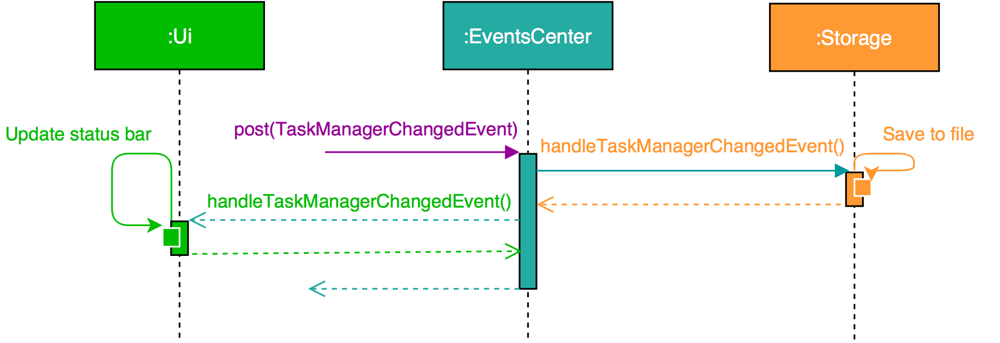
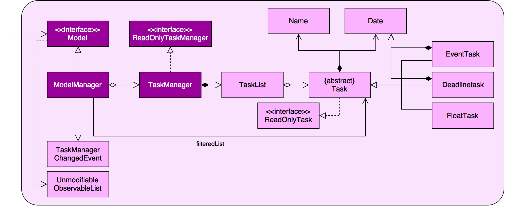
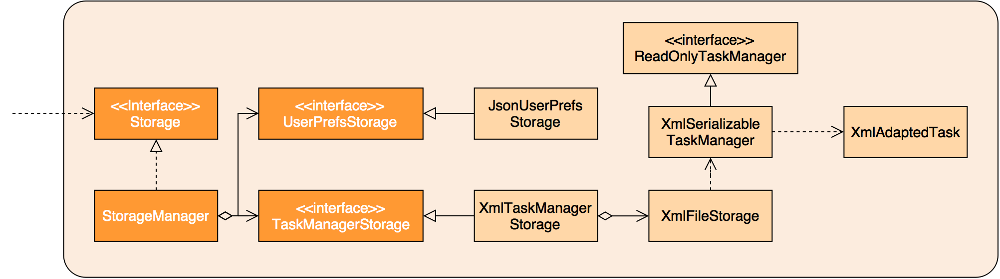

# Taskle Developer Guide 

<!-- @@author A0125509H -->

## Introduction
Taskle is a task management application that helps users to keep track of their tasks efficiently.  It comprises a Command Line Interface (CLI) for the input and a Graphical User Interface (GUI) for the output of commands respectively.

This guide describes the design and implementation of Taskle. It will help you understand how Taskle works and how you can further contribute to its development. We have organised this guide in a top-down manner so that you can understand the big picture before moving on to the more detailed sections.
  
## Table of Contents
* [Setting Up](#setting-up)
* [Design](#design)
* [Implementation](#implementation)
* [Testing](#testing)
* [Dev Ops](#dev-ops)
* [Appendix A: User Stories](#appendix-a--user-stories)
* [Appendix B: Use Cases](#appendix-b--use-cases)
* [Appendix C: Non Functional Requirements](#appendix-c--non-functional-requirements)
* [Appendix D: Glossary](#appendix-d--glossary)
* [Appendix E : Product Survey](#appendix-e--product-survey)

<!-- @@author A0141780J -->

## Setting up

#### Prerequisites

1. **JDK `1.8.0_60`**  or later. 

    > Having any Java 8 version is not enough.  
    This application will not work with earlier versions of Java 8.
2. **Eclipse** IDE.
3. **e(fx)clipse** plugin for Eclipse (Follow from Step 2 onwards given in
   [this page](http://www.eclipse.org/efxclipse/install.html#for-the-ambitious)).
4. **Buildship Gradle Integration** plugin from the Eclipse Marketplace.

 

#### Importing the Project into Eclipse

0. Fork this repo, and clone it to your computer.
1. Open Eclipse. (Note: Ensure that you have installed the **e(fx)clipse** and **buildship** plugins as given in the prerequisites above).
2. Click `File` > `Import`.
3. Click `Gradle` > `Gradle Project` > `Next` > `Next`.
4. Click `Browse` and locate the project's directory.
5. Click `Finish`.

> * If you are asked to either 'keep' or 'overwrite' configuration files, 'keep' them.
> * Depending on your connection speed and server load, it can take up to 30 minutes for the set-up to finish. (This is because Gradle downloads library files from servers during the set-up process of the project).
> * If Eclipse automatically changed any "settings" files during the import process, you can discard the changes.

 

## Design

### Architecture

Figure 1: Architecture Diagram
 

The **_Architecture Diagram_** given above explains the high-level design of the application. Below is a quick overview of each component.

`Main` only has one class called [`MainApp`](../src/main/java/taskle/MainApp.java). It is responsible for:
* Initializing the components in the correct sequence, and connecting them up with each other, upon the launch of the application.
* Shutting down the components and invoking cleanup method (where necessary) upon shut down.

[**`Commons`**](#common-classes) represents a collection of classes that is used by other multiple components. Two of them play important roles at the architecture level:
* `EventsCentre`: This class (written using [Google's Event Bus library] (https://github.com/google/guava/wiki/EventBusExplained)) is used by components to communicate with other components through the use of events (i.e. a form of _Event Driven_ design).
* `LogsCenter`: Used by many classes to write log messages to the application's log file.

The rest of the application consists four components:
* [**`UI`**](#ui-component) : Responsible for the User Interface of the application.
* [**`Logic`**](#logic-component) : Executes user commands.
* [**`Model`**](#model-component) : Holds the data of the application in-memory.
* [**`Storage`**](#storage-component) : Reads data from, and writes data to, the hard disk.

Each of the four components:
* Defines its _API_ in an `interface` with the same name as the Component.
* Exposes its functionality using a `{Component Name}Manager` class.

For example, the `Logic` component (see the class diagram given below) defines it's API in the `Logic.java` interface and exposes its functionality using the `LogicManager.java` class.

Figure 2: Logic Class Diagram Example
 

The four components `UI`, `Logic`, `Model`, and `Storage` interact with one another to provide the functionality of the application.

For example, the _Sequence Diagram_ below shows how the components interact in a scenario where the user issues a command `remove 1`.

Figure 3: Sequence Diagram for Remove Task to show Component Interaction
 

>Note how the `Model` simply raises a `TaskManagerChangedEvent` when Taskle's data are changed, instead of asking the `Storage` to save the updates to the hard disk.

The diagram below shows how the `EventsCenter` reacts to the `TaskManagerChangedEvent`. This results in the updates being saved to the hard disk and the status bar of the UI being updated to reflect the 'Last Updated' time.

Figure 4: Sequence Diagram for Handling of Events
 

> Note how the event is propagated through the `EventsCenter` to the `Storage` and `UI` without `Model` having to be coupled to either of them. This is an example of how this Event Driven approach helps us reduce direct coupling between components.

The sections below give more details of each component.

<!-- @@author A0125509H -->

### UI component

Figure 5: User Interface Class Diagram
 

**API**: [`Ui.java`](../src/main/taskle/ui/Ui.java)

The UI consists of a `MainWindow` that is made up of parts `CommandBox`, `CommandResult`, `TaskListPanel`, `StatusBarFooter`, `StatusDisplayPanel` and `TaskCard`. All these, including the `MainWindow`, inherit from the abstract `UiPart` class, and can be loaded through `UiPartLoader`.

The `UI` component uses JavaFx UI framework. The layout of these UI parts are defined in matching `.fxml` files that are in the `src/main/resources/view` folder.

For example, the layout of the [`MainWindow`](../src/main/java/taskle/ui/MainWindow.java) is specified in [`MainWindow.fxml`](../src/main/resources/view/MainWindow.fxml)

The `UI` component:
* Executes user commands through the `Logic` component.
* Binds itself to some data in the `Model` so that the UI can auto-update when data in the `Model` change.
* Responds to events raised from various parts of the application before updating the UI accordingly.

<!-- @@author A0141780J -->

### Logic component

Figure 6: Logic Class Diagram
 

**API**: [`Logic.java`](../src/main/taskle/logic/Logic.java)

The sequence flow of how `Logic` works is as follows.

1. `Logic` uses the `Parser` class to parse the user command.
2. `Parser` uses the CommandParser classes to parse the command.
3. It returns a `Command` object which is executed by the `LogicManager`.
4. The command execution can affect the `Model` and/or raise events.
	* Example: Adding a task.
5. The result of the command execution is encapsulated as a `CommandResult` object which is passed back to the `Ui`.

Given below is the Sequence Diagram for interactions within the `Logic` component for the `execute("remove 1")` API call.

Figure 7: Remove Task Logic Sequence Diagram
 

Given below is another Sequence Diagram for interactions within the `Logic` component for the `execute("undo")` API call. Notice the differences between the remove and undo commands.

Figure 8: Undo Command Logic Sequence Diagram
 

<!-- @@author A0140047U -->

### Model component

Figure 9: Model Class Diagram
 

**API**: [`Model.java`](../src/main/taskle/model/Model.java)

The `Model` component:
* Stores a `UserPref` object that represents the user's preferences.
* Stores Taskle's data.
* Exposes a `UnmodifiableObservableList<ReadOnlyTask>` that can be 'observed'.
	* Example: The UI can be bound to this list so that it automatically updates when the data in the list changes.
* Does not depend on any of the other three components.
* Stores the current instance of Taskle should the user input a mutating command, such as `add`.

<!-- @@author A0139402M -->

### Storage component

Figure 10: Storage Class Diagram
 

**API**: [`Storage.java`](../src/main/taskle/storage/Storage.java)

The `Storage` component:
* Can save `UserPref` objects in json format before reading it back.
* Can save Taskle's data in xml format before reading it back.

<!-- @@author -->

### Common classes

* Classes used by multiple components are in the `taskle.commons` package.

 

## Implementation

### Logging

We are using `java.util.logging` package for logging. The `LogsCenter` class is used to manage the logging levels and destinations through the following:

* The logging level can be controlled using the `logLevel` setting in the configuration file
  (See [Configuration](#configuration).)
* The `Logger` for a class can be obtained using `LogsCenter.getLogger(Class)`, which will log messages according to the specified logging level.
* Log messages' current outputs are to: `Console` and a `.log` file.

**Logging Levels**

* `SEVERE` : Detected a critical problem which may possibly cause the termination of the application.
* `WARNING` : Can continue, but proceed with caution.
* `INFO` : Information showing the noteworthy actions by the application.
* `FINE` : Unnoteworthy details that may be useful in debugging.
	* Example: Printing of the actual list instead of its size.

### Configuration

* Certain properties of the application can be controlled through the configuration file (default: `config.json`).
	* Example: Application name or logging level.

 

## Testing

Tests can be found in the `./src/test/java` folder.

**In Eclipse**:
> If you are not using a recent Eclipse version (i.e. _Neon_ or later), enable assertions in JUnit tests as described [here](http://stackoverflow.com/questions/2522897/eclipse-junit-ea-vm-option).

* To run all tests, right-click on the `src/test/java` folder and choose `Run as` > `JUnit Test`.
* To run a subset of tests, you can right-click on a test package, test class, or a test and choose to run as a JUnit test.

**Using Gradle**:
* See [UsingGradle.md](UsingGradle.md) on how you can run tests using Gradle.

We have two types of tests:

1. **GUI Tests** - They are _System Tests_ that test the entire application by simulating user actions on the GUI. They are in the `guitests` package.
2. **Non-GUI Tests** - They are tests that do not involve the GUI. They include:
   1. _Unit tests_ targeting the lowest level methods/classes.
	* Example: `taskle.commons.StorageUtilTest`
   2. _Integration tests_ that are checking the integration of multiple code units (they are assumed to be working).
	* Example: `taskle.storage.StorageManagerTest`
   3. Hybrids of unit and integration tests. They check multiple code units as well as how the are connected together.
	* Example: `taskle.logic.LogicManagerTest`
  
**Headless GUI Testing**:
* Thanks to the [TestFX](https://github.com/TestFX/TestFX) library that we use, our GUI tests can be run in the _headless_ mode. In the headless mode, GUI tests do not show up on the screen. This means that the developer can do other things on the Computer while the tests are running.
* Check out [UsingGradle.md](UsingGradle.md#running-tests) to learn how to run tests in headless mode.

 

## Dev Ops

### Build Automation

* See [UsingGradle.md](UsingGradle.md) to learn how to use Gradle for build automation.

### Continuous Integration

* We use [Travis CI](https://travis-ci.org/) to perform _Continuous Integration_ on our projects.
* See [UsingTravis.md](UsingTravis.md) for more details.

### Making a Release

Here are the steps to create a new release.
 
 1. Generate a JAR file [using Gradle](UsingGradle.md#creating-the-jar-file).
 2. Tag the repo with the version number.
 	* Example: `v0.1`
 2. [Crete a new release using GitHub](https://help.github.com/articles/creating-releases/) and upload the JAR file that you created.
   
### Managing Dependencies

* A project often depends on third-party libraries. For example, Taskle depends on the
[Jackson library](http://wiki.fasterxml.com/JacksonHome) for XML parsing. Managing these _dependencies_ can be automated using Gradle. Gradle can download the dependencies automatically, which is better than these alternatives:
	* Include those libraries in the repo (this bloats the repo size).
	* Require developers to download those libraries manually (this creates extra work for developers).

<!-- @@author A0141780J -->

 

## Appendix A : User Stories

Priorities: High (Very likely) - `* * *`, Medium (Likely) - `* *`, Low (Unlikely) - `*`

|      | Priority| As a | I want to                                   | so that                          |
| ---- | :------ |----- | ------------------------------------------- | -------------------------------- |
| Epic |         | user | get information about supported commands    |                                |
|      | `* * *` | user | list out all supported commands and how to use them | I know what I can do with the application |
|      | `* *`   | user | get specific information about each command | I know how to use each command correctly |
| Epic |         | user | add to-do items                             |                                  |
|      | `* * *` | user | add tasks without specific date or times    | I can keep track of tasks without date and times associated with them |
|      | `* * *` | user | add tasks that have to be completed before a certain date | I can keep track of my deadlines|
|      | `* * *` | user | add events with start and end dates         |I can keep track of my event dates|
| Epic |         | user | view a list of my existing to-do items      |                                  |
|      | `* * *` | user | view a list of my to-do items in chronological order by their date and times    | I can easily identify which items are more urgent  |
|      | `* * *` | user | view a list of to-do items that are not done|I know what are my remaining tasks|
|      | `* *`   | user | view a list of to-do items that are done    | I know what tasks have been done |
|      | `*`     | user | view a list of to-do items filtered by whether they are done, pending or overdue | I can easily keep track of my tasks and their respective statuses|
| Epic |         | user | edit my existing to-do items                |                                  |
|      | `* * *` | user | edit my existing to-do items directly       | I do not have to delete and add the to-do item again to modify it |        |
|      | `* * *` | user | mark todo items as done                     | I can indicate that the task has been completed |
| Epic |         | user | delete to-do items                          |                                  |
|      | `* * *` | user | delete a specific to-do item                |                                  |
|      | `*`     | user | delete multiple to-do items at one go       | I can quickly delete a few items |
| Epic |         | user | undo my commands                            |                                  |
|      | `* * *` | user | undo my most recent command                 | I can revert the most recent command if it was wrongly issued |
|      | `*`     | user | redo my most recently undid command         | I can revert the last undo command if it was wrongly issued |
|      | `*`     | user | undo any commands issued for the current session| I can revert any wrongly issued commands from the current session |
| Epic |         | user | find an item in my todo-list               |                                  |  
|      | `* * *` | user | find an item by searching for some keywords from the item description         | I can find a task by its description |
| Epic |         | user | manage reminders for my tasks              |                                 |
|      | `*`     | user | add reminders for my tasks                 | I would be reminded of my tasks when needed |
|      | `*`     | user | delete reminders for my tasks              | I can remove reminders when they are not needed |
|      | `*`     | user | edit reminders for my tasks                | I can change reminders when needed without removing and adding them again |
| Epic |         | user | make changes to my application configuration | I can customize it to suit my needs | 
|      | `* * *` | user | specify a specific folder as the data storage location                       | I can save the data file into any directory I want |
|      | `*`     | user | switch to using another existing data storage file                           | I can reuse my data storage file from another device or session |

<!-- @@author A0140047U -->

 

## Appendix B : Use Cases

For all use cases below, the **System** is `Taskle` and the **User** is the `user`, unless specified otherwise.
  
#### Use case: [UC01] Add Floating Task

**MSS**

1. User enters command to add a new floating task.
2. System adds new floating task.  
Use Case ends.

**Extensions**

1a. Incorrect command format.

> 1ai. System displays an error message.  
  Use Case ends.

 

#### Use case: [UC02] Add Float Task with Reminder

**MSS**

1. User enters command to add a new float task with a reminder date and time.
2. System adds new float task with reminder.  
Use Case ends.

**Extensions**

1a. Incorrect command format.

> 1ai. System displays an error message.  
  Use Case ends.

1b. User enters invalid reminder date.

> 1bi. System displays an error message.  
  Use Case ends.
  
 
  
#### Use case: [UC03] Add Deadline Task

**MSS**

1. User enters command to add a new deadline task with a specified date.
2. System adds new deadline task.  
Use Case ends.

**Extensions**

1a. Incorrect command format.

> 1ai. System displays an error message.  
  Use Case ends.

1b. User enters an invalid date.

>1bi. System displays an error message.  
  Use Case ends.

 

#### Use case: [UC04] Add Deadline Task with Reminder

**MSS**

1. User enters command to add a new deadline task with a specified date along with a reminder date and time.
2. System adds new deadline task with reminder.  
Use Case ends.

**Extensions**

1a. Incorrect command format.

> 1ai. System displays an error message.  
  Use Case ends.

1b. User enters an invalid date.

>1bi. System displays an error message.  
  Use Case ends.

1c. User enters an invalid reminder date.

>1ci. System displays an error message.  
  Use Case ends.
  
1d. User enters a reminder date after deadline date.

>1di. System displays an error message.  
  Use Case ends.

 
  
#### Use case: [UC05] Add Event Task

**MSS**

1. User enters command to add a new event task with 2 specified dates (from and to).
2. System adds new event task.  
Use Case ends.

**Extensions**

1a. Incorrect command format.

> 1ai. System displays an error message.  
  Use Case ends.

1b. User enters an invalid date.

>1bi. System displays an error message.  
  Use Case ends.
  
1c. More than 2 dates entered.

>1ci. System displays an error message.  
  Use Case ends.
    
 
   
#### Use case: [UC06] Add Event Task with Reminder

**MSS**

1. User enters command to add a new event task with 2 specified dates (from and to) along with a reminder date and time.
2. System adds new event task with reminder.  
Use Case ends.

**Extensions**

1a. Incorrect command format.

> 1ai. System displays an error message.  
  Use Case ends.

1b. User enters an invalid date.

>1bi. System displays an error message.  
  Use Case ends.
  
1c. More than 3 dates entered.

>1ci. System displays an error message.  
  Use Case ends.

1d. User enters an invalid reminder date.

>1di. System displays an error message.  
  Use Case ends.
  
1e. User enters a reminder date after the end date of the event.

>1ei. System displays an error message.  
  Use Case ends.
    
 
     
#### Use case: [UC07] Rename Task

**Preconditions**

Task exists in system.

**MSS**

1. User enters command to rename a task.
2. System renames task.  
Use Case ends.

**Extensions**

1a. Incorrect command format.

> 1ai. System displays an error message.  
  Use Case ends.

1b. User enters an invalid task number.

> 1bi. System displays an error message.  
  Use Case ends.

 

#### Use case: [UC08] Reschedule Task

**Preconditions**

Task exists in system.

**MSS**

1. User enters command to reschedule a task to the specified date.
2. System reschedules task.  
Use Case ends.

**Extensions**

1a. Incorrect command format.

> 1ai. System displays an error message.  
  Use Case ends.

1b. User enters an invalid task number.

> 1bi. System displays an error message.  
  Use Case ends.
  
1c. User enters an invalid date.

>1ci.  System displays an error message.  
  Use Case ends.
  
1d. User enters more than 2 dates.

>1di.  System displays an error message.  
  Use Case ends.

 
  
#### Use case: [UC09] Remove Date(s) associated with Task

**Preconditions**

Task exists in system.

**MSS**

1. User enters command to clear the date(s) associated with a task.
2. System removes the date.  
Use Case ends.

**Extensions**

1a. Incorrect command format.

> 1ai. System displays an error message.  
  Use Case ends.

1b. User enters an invalid task number.

> 1bi. System displays an error message.  
  Use Case ends.
  
 

#### Use case: [UC10] Set Reminder for Task

**Preconditions**

Task exists in system.

**MSS**

1. User enters command to set reminder for task.
2. System sets the reminder for task.  
Use Case ends.

**Extensions**

1a. Incorrect command format.

> 1ai. System displays an error message.  
  Use Case ends.

1b. User enters an invalid task number.

> 1bi. System displays an error message.  
  Use Case ends.
  
1c. User enters an invalid date and time.

>1ci.  System displays an error message.  
  Use Case ends. 
  
1d. User enters a reminder date after the end date of the current task
>1ci.  System displays an error message.  
  Use Case ends. 
  
 

#### Use case: [UC11] Remove Reminder for Task

**Preconditions**

Task exists in system.

**MSS**

1. User enters command to remove reminder for task.
2. System removes the reminder for task.  
Use Case ends.

**Extensions**

1a. Incorrect command format.

> 1ai. System displays an error message.  
  Use Case ends.

1b. User enters an invalid task number.

> 1bi. System displays an error message.  
  Use Case ends.
  
 
  
#### Use case: [UC12] Remove Single Task

**Preconditions**

Task exists in system.

**MSS**

1. User enters command to remove a task.
2. System removes task.  
Use Case ends.

**Extensions**

1a. Incorrect command format.

> 1ai. System displays an error message.  
  Use Case ends.

1b. User enters an invalid task number.

> 1bi. System displays an error message.  
  Use Case ends.

 

#### Use case: [UC13] Remove Multiple Tasks

**Preconditions**

Task exists in system.

**MSS**

1. User enters command to remove multiple tasks.
2. System removes multiple tasks.  
Use Case ends.

**Extensions**

1a. Incorrect command format.

> 1ai. System displays an error message.  
  Use Case ends.

1b. User enters an invalid task number.

> 1bi. System displays an error message.  
  Use Case ends.

 

#### Use case: [UC14] Clear All Tasks

**MSS**

1. User enters command to clear all tasks.
2. System clear all tasks.  
Use Case ends.

 

#### Use case: [UC15] Mark Task as Done

**Preconditions**

Task exists in system and is of "Pending" status.

**MSS**

1. User enters command to mark task as done.
2. System marks tasks as done.  
Use Case ends.

**Extensions**

1a. Incorrect command format.

> 1ai. System displays an error message.  
  Use Case ends.

1b. User enters an invalid task number.

> 1bi. System displays an error message.  
  Use Case ends.
    
 

#### Use case: [UC16] Find Task

**Preconditions**

Task exists in system.

**MSS**

1. User enters command to find a task.
2. System displays tasks corresponding to search query.  
Use Case ends.

**Extensions**

1a. Incorrect command format.

> 1ai. System displays an error message.  
  Use Case ends.

1b. No tasks matches search query.

> Use Case ends.

 

#### Use case: [UC17] List Tasks

**Preconditions**

Tasks exists in system.

**MSS**

1. User enters command to list a tasks.
2. System displays list of pending and overdue tasks by default unless otherwise stated by the User.  
Use Case ends.

**Extensions**

1a. Incorrect command format.

> 1ai. System displays an error message.  
  Use Case ends.

 

#### Use case: [UC18] Undo Command

**MSS**

1. User enters undo command.
2. System undo previous command.  
Use Case ends.

**Extensions**

1a. No commands to undo.

> 1ai. System displays "Nothing to Undo" message.  
  Use Case ends.

 

#### Use case: [UC19] Redo Command

**MSS**

1. User enters redo command.
2. System redo previous command.  
Use Case ends.

**Extensions**

1a. No commands to redo.

> 1ai. System displays "Nothing to Redo" message.  
  Use Case ends.

 

#### Use case: [UC20] View Help

**MSS**

1. User enters help command.
2. System displays list of commands available.  
Use Case ends.

 
	
#### Use case: [UC21] Change Save Directory

**MSS**

1. User requests to change save directory.
2. User chooses file directory.
3. System updates file directory.  
Use Case ends.

**Extensions**

1a. User cancels request.

> Use Case ends.

2a. Requested directory is invalid or does not exist.

> 2ai. System displays error message.  
  Use Case ends.

2b. Requested directory is the same as current directory.

> 2bi. System displays "Requested directory is the same as current" message.  
  Use Case ends.

2c. File with the same name as currently opened file exists in requested directory.

> 2ci. System displays "Existing file found in requested directory" message.  
  Use Case ends.

 

#### Use case: [UC22] Open Storage File

**MSS**

1. User requests to open a storage file.
2. User chooses file to open.
3. System updates storage file.  
Use Case ends.

**Extensions**

1a. User cancels request.

> Use Case ends.

2a. Requested file is invalid or does not exist.

> 2ai. System displays error message.  
  Use Case ends.

2b. Requested file is currently viewed.

> 2bi. System displays "You are already viewing the requested file" message.  
  Use Case ends.

<!-- @@author A0139402M -->
 

## Appendix C : Non Functional Requirements

1. Should work on Windows 7 or later.
2. Should work on a desktop without either a network or Internet connection.
3. Should have minimal mouse-click actions.
4. Should work stand-alone, not as a plug-in to another software.
5. Should store data locally into a human editable file.
6. Should work without requiring an installer. 
7. Should be able to hold up to 1000 to-do items.
8. Should come with automated unit tests and open source code.
9. Should display command results within 100 milliseconds.
10. Should favor DOS style commands over Unix-style commands.

<!-- @@author A0140047U -->

 

## Appendix D : Glossary

##### Floating Task

> A stand-alone task that does not need to be completed by a certain date or time.

##### Deadline Task

> A task that has to be completed before a certain date or time.

##### Event Task

> A task that occurs over a period of time.

##### Human-Editable File

> A file that can be easily read and edited by a human. For example: `.txt`

##### "Completed" Task

> A task that has been marked as done.

##### "Overdue" Task

> A task that has not been completed within the expected time.

##### "Pending" Task

> A task that has yet to be completed.

##### Storage File Location

> The directory in a computer where the application stores the data of to-do items.

 

## Appendix E : Product Survey

The team has conducted a survey on existing products and analysed the strengths and weaknesses with respect to how well it can cater to our target audience.

**Product #1: Wunderlist** 
Strengths:

1. Supports adding of floating tasks and deadlines. User’s one-shot approach is met when adding floating tasks.
2. Supports editing and deleting of existing tasks. User is able to not only reschedule, but also discard tasks that cannot be completed.
3. Supports adding of deadlines and reminders. User will be reminded when a deadline is approaching.
4. Supports searching and sorting of to-do items. User is able to find specific tasks easily.
5. Supports viewing of tasks that are completed. User is able to know which tasks are completed and which are yet to be completed. 
6. Supports offline work. User does not have to depend on Internet connectivity to use application.
7. Displays tasks in a user-friendly manner.

Weaknesses:

1. Does not work with time slots. User is not able to manage events.
2. Does not categorise tasks. User may find it hard to differentiate floating tasks from deadlines.
3. Does not support an "Undo" option. Tasks that were incorrectly added has to be edited or deleted manually.
4. Does not store data into local storage files but links to an online user account instead. Internet connectivity is still dependent if user wants to work from different computers.
5. Requires a few clicks to perform functions other than adding a floating task. User’s one-shot approach is not met.

 

<!-- @@author A0141780J -->

**Product #2: Google Keep** 
Strengths:

1. Supports adding of checklist items. User is able to mark tasks as done.
2. Supports time-based reminders. User is able to schedule reminders for his deadlines.
3. Supports searching of tasks by description and types. User is able to find a task quickly.
4. Displays tasks in a user-friendly manner. User is able to periodically review his tasks.
5. Operates even without Internet access. User is able to access the application even without Internet connectivity.

Weaknesses:

1. Does not support calendar-centric operations. User is not able to schedule tasks with specific start and end dates.
2. Requires a few clicks to add tasks followed by setting reminders. User’s one-shot preference is not met.
3. Supports reminders only. User is not allowed to block out slots for tasks without specific times.

 

<!-- @@author A0139402M -->

**Product #3: to-doist** 
Strengths:

1. Supports adding of tasks that can be marked as 'done'. User is able to mark completed tasks as done.
2. Supports adding of tasks in a one-shot approach. User can avoid taking several clicks to add a task.
3. Supports adding of tasks with no specific time tagged to it. User is able to add tasks that do not require a specific time to be completed.
4. Supports searching of tasks by its name and project. User is able to find a task quickly. 
5. Supports a desktop version. User is able to access the application quickly from his computer.
6. Operates offline and only starts syncing with other devices when there is Internet connection. User can access the application without internet connectivity.
7. Allows easy and straightforward postponement of tasks. User can easily postpone tasks should the need arise.

Weaknesses:

1. Does not allow for block scheduling of tasks (e.g. Tasks can only be scheduled at 3pm, not 3 - 5pm). User cannot schedule tasks in block timings.
2. Does not provide a user-friendly way to look for a suitable slot to schedule an item. User has to go through all existing tasks to look for an empty slot to schedule a new task.
3. Does not support blocking of multiple slots for tasks with unconfirmed timings. User will find it hard to schedule tasks with unconfirmed timings.
4. Syncs data with the cloud only when there is Internet connectivity. User requires Internet connectivity if he wants to use the application with all his existing tasks on another computer.

 

<!-- @@author A0125509H -->

**Product #4: SolCalendar** 
Strengths:

1. Supports adding of tasks without any due dates. 
2. Supports editing and deleting of existing tasks. User is able to reschedule and remove tasks.
3. Supports marking tasks as ‘done’.
4. Supports searching of tasks by name. User is able to quickly search for items in his schedule. 
5. Supports time-based reminders. User can schedule reminders for his deadlines.
6. Supports setting of tasks on repeat, for routine purposes.
7. Operates even without Internet connectivity. User can access the application even without Internet connectivity.
8. Allows easy and straightforward postponement of tasks. User can easily postpone tasks should the need arise.
9. Displays to-do items in a user-friendly manner. User can periodically review his to-do list.

Weaknesses:

1. Does not support an "Undo" option. A task has to be manually deleted upon creation.
2. Does not support blocking out specific time slots.
3. Requires two clicks to add a task with respective settings. User’s one-shot preference is not catered to.
