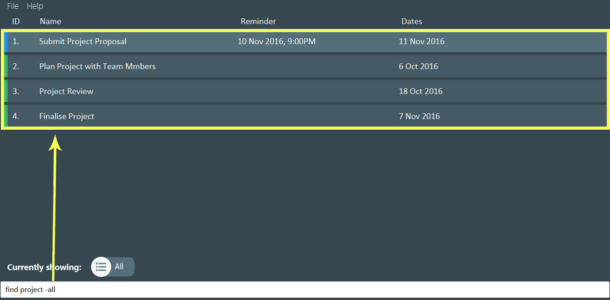
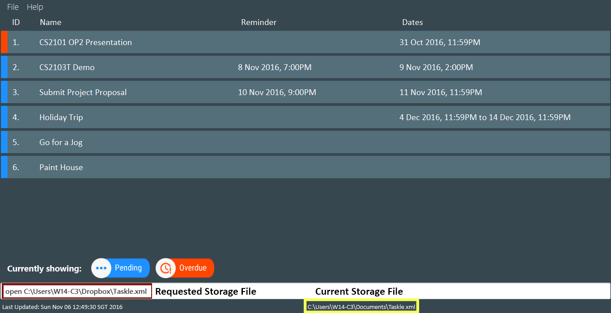
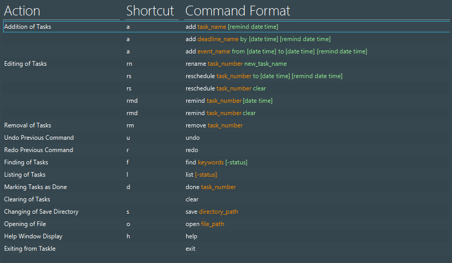

# User Guide

* [About](#about)
* [Quick Start](#quick-start)
* [Features](#features)
* [FAQ](#faq)
* [Command Summary](#command-summary)

<!-- @@author A0125509H -->
## About
Do you have so many tasks to do every day that you simply cannot keep track of them anymore? Don't you wish that there was an easier way to stay on top of your daily tasks without feeling stressed out?

Taskle is here to help you with all of that! It is a task management application with a single text box for all your commands. Coupled with its simplicity, managing your tasks has never been this easy!

Reorganize your life now by using Taskle!

<!-- @@author A0139402M -->
## Quick Start

0. Ensure that you have Java version `1.8.0_60` or later installed in your computer. 
   > Having any Java 8 version is not enough.  
   This application will not work with earlier versions of Java 8.
   
1. Download the latest `Taskle.jar` from the [releases](../../../releases) tab.

2. Copy the file to the folder where you want to use Taskle.

3. Double-click on the file to start the application. The Graphical User Interface (GUI) should appear in a few seconds.
	
	> 
	
Figure 1: GUI of Taskle

4. Type the command in the command box and press <kbd>Enter</kbd> to execute it.
	> Example: Typing **`help`** and pressing <kbd>Enter</kbd> will open up the help window.
 
5. Some commands that you can try:
   * `add` **`Buy Milk`** : Adds a "Buy Milk" task into Taskle.
   * `add` **`Submit Proposal by 7 Nov`** : Adds a "Submit Proposal" task which is to be completed by 7 Nov.
   * `remove` **`5`** : Removes the task with index 5 from the current list.
   * `clear`: Clears all tasks from Taskle.
   * `exit` : Exits from Taskle.
   
6. Refer to the [Features](#features) section for details of each command. 

<!-- @@author A0141780J -->
## Features

Taskle makes managing your tasks both simple and elegant as all of its features can be accessed with a single line of command!

> **Note that the following conventions are used for all command formats:**
> * **`BOLDED`** words are parameters.
> * Items in `[SQUARE_BRACKETS]` are optional.
> * The order of parameters is fixed.

 

### Add a Task / Event: `add`
   * Adds a task / event into Taskle (with its respective deadline or end-date.)
   * A reminder time can be set for tasks / events.
   * The time parameter is optional.  

| Format  
| :-------- 
| `add` **`task_name`** `remind` [**`date time`**] | 
| `add` **`task_name`** `by` [**`date time`**] `remind` [**`date time`**] |
| `add` **`task_name`** `from` [**`date time`**] `to` [**`date time`**] `remind` [**`date time`**]

> **Things to Note**
> * You may enter the date and time in any format that you desire, and Taskle will still be able to recognise it.
>	* Example: "add Do Homework by **tmr**" adds a task with the name "Do Homework" with the deadline to be set to tomorrow (tmr is recognised as tomorrow.)
> * Only the words after the last **by** or **from** in your input will be accepted as the date and time. This allows you to continue using **by** and **from** as part of your task name as long as you enter the date and times last.
> 	* Example: "add Gardens by the Bay **from** 9am to 9pm today" adds a task with the name "Gardens by the Bay" with the date and time to be set to "today, 9am to 9pm".
> * Should the entered name be too long, it will appear truncated with ellipses on the application. However, you can still view the full name by clicking and holding down your mouse button. 

Examples:
* `add` **`Pay Phone Bills`**
* `add` **`Do CS2101 Assignment`** `by` **`12 Oct`**
* `add` **`Business Trip`** `from` **`4 Oct`** `to` **`5 Oct`** `remind` **`3 Oct 2pm`**

Figure 2: Adds a task with the name "Pay Phone Bills" into Taskle
 
	
 

<!-- @@author A0140047U -->
### Edit a Task: `rename; reschedule; remind`
Edits an existing task in Taskle. There are three types of possible edits: Rename, Reschedule and Remind. You are required to input the **task_number** (as indicated in Figure 3) in order for Taskle to identify the task that you wish to edit.  

Type | Format  
:-------- | :-------- 
Rename | `rename` **`task_number`** **`new_task_name`**  
Reschedule | `reschedule` **`task_number`** [**`date time`**] `to` [**`date time`**] `remind` [**`date time`**]
Remind | `remind` **`task_number`** [**`date time`**]

> **Things to Note**
> * A  task can only have **one reminder**. The date and time that were specified in the "remind" command will replace any existing reminder.
> * If **no time** was specified for the reminder, Taskle will automatically assign 00:00 of the specified reminder date to it.
> * To remove a reminder or deadline from a task, you will have to type **"clear"** after typing the task number. For example:
>	* remind **2 clear**
>	* reschedule **2 clear**

Examples:
* `rename` **`8 Pay Abel for Chicken Rice`**

Figure 3: Renames Task 8 to "Pay Abel for Chicken Rice" (Before)
 

Figure 4: Renames Task 8 to "Pay Abel for Chicken Rice" (After)
 

* `reschedule` **`2`** `to` **`9th November 2pm`**

Figure 5: Reschedules Task 2 to "9th November 2pm" (Before)
 

Figure 6: Reschedules Task 2 to "9th November 2pm" (After)
 

* `remind` **`2 8th November 7pm`**
	

Figure 7: Sets a Reminder for Task 2 on "8th November 7pm" (Before)
 

	

Figure 8: Sets a Reminder for Task 2 on "8th November 7pm" (After)
 

 

<!-- @@author A0125509H -->
### Remove a Task: `remove`
Removes a task from Taskle permanently.  

| Format  
| :-------- 
| `remove` **`task_number`** | 

Examples:
* `remove` **`8`**

	

Figure 9: Removes Task 8 from Taskle
 

 

<!-- @@author A0139402M -->
### Finding a Task : `find`
Finds all tasks in Taskle that contains the keywords and fulfills the status as specified.  

| Format  
| :-------- 
| `find` **`keywords [-status]`** | 

> **Things to Note**
> * The following statues are available:
>	* **-all**: All tasks in Taskle
>	* **-pending**: Tasks that are still pending.
>	* **-done**: Tasks that are marked as done.
>	* **-overdue**: Tasks that are overdue (applicable for deadlines only.)
> * All tasks that match the list of keywords and the statuses specified would be displayed.
> * You must specify at least one keyword when using find.
> * It is optional to specify the status. If no status is specified, the default
tasks to be displayed are the pending and overdue ones. 
> * You may specify more than one status. In that case all tasks that fulfill any of the flags would be displayed. For example:
>	* find meeting task **-pending** **-overdue**

Examples:
* `find` **`project`**

Figure 10: Find pending and overdue Tasks that have "project" in its name
 

* `find` **`project -all`**	
	

Figure 11: Find all Tasks that have "project" in its name
 
 

<!-- @@author A0140047U -->
### Listing tasks: `list`
Lists tasks according to specified statuses. Use this command to view your tasks
according to whether they are done, overdue or pending.  

| Format  
| :-------- 
| `list` **`[-status]`**| 

> **Things to Note**
> * The following statues are available:
>	* **-all**: All tasks in Taskle
>	* **-pending**: Tasks that are still pending.
>	* **-done**: Tasks that are marked as done.
>	* **-overdue**: Tasks that are overdue (applicable for deadlines only.)
> * It is optional to specify the status. If no status is specified, the default
tasks to be displayed are the pending and overdue ones. (Done tasks are not shown).
> * You may specify more than one status. In that case all tasks that fulfill any of the flags would be displayed. For example:
>	* list **-pending** **-overdue**

Example:
* `list` **`-all`**

 

<!-- @@author A0125509H -->
### Mark a Task as Done: `done`
Marks a task as done. Use this command when you are finished with the task. 

| Format  
| :-------- 
| `done` **`task_number`** | 

Example:
* `done` **`5`**

Figure 12: Mark Task 5 as done
 
 

<!-- @@author A0140047U -->
### Undoing a Recent Command: `undo`
Undo a previous command. This command is used when you wish to revert from the most recently issued command.  

| Format  
| :-------- 
| `undo` | 

 

### Redoing a Undo: `redo`
Redo a previous command. This command is used when you wish to revert a wrongly issued undo command  

| Format  
| :-------- 
| `redo` | 

 

<!-- @@author A0139402M -->
### Clearing all Tasks: `clear`
Clears all tasks from Taskle.  

| Format  
| :-------- 
| `clear` | 

<!-- @@author A0140047U -->
### Change Save Directory: `save`
Changes save location of Taskle data file.  

| Format  
| :-------- 
| `save` **`directory_path`**|

 

> **Thing to Note**
> * You are also able to change your save directory from the menu option.

Example:
* `save` **`C:\Users\W14-C3\Dropbox`**

 

Figure 13: Change Save Directory
 
 
### Open File: `open`
Opens a Taskle data file.  

| Format  
| :-------- 
| `open` **`file_path`**|

 

> **Thing to Note**
> * You are also able to open your file from the menu option.

Example:
* `open` **`C:\Users\W14-C3\Dropbox\Taskle.xml`**

 

Figure 14: Open a Storage File
 

<!-- @@author A0139402M -->
### View Help: `help`
Displays a list of available commands. 

| Format  
| :-------- 
| `help` | 

 

> **Things to Note**
> * Help is also shown if you enter an incorrect command. For example: `abcd`.
> * A list of available commands is shown in a separate window so you can refer to it while using Taskle.

 

Figure 15: View all commands in the help list
 
 

### Exit Taskle: `exit`
Exits and closes Taskle.  

| Format  
| :-------- 
| `exit` |
 
  

<!-- @@author A0141780J -->
## FAQ

**Q**: How do I transfer my data to another computer? 
**A**: Install the application in the other computer and overwrite the empty data file it creates with the file created in your previous Taskle folder. You can also use Taskle’s save and open features to transfer your data.
       
## Command Summary

The table below shows the overall list of commands used in the application. 
Note the following conventions used:
* **`BOLDED`** words are parameters.
* Items in `[SQUARE_BRACKETS]` are optional.
* The order of parameters is fixed.

Command `(Shortcut)` | Format  
:-------- | :-------- 
Add `a` | `add `**`task_name`**` [remind `**`date time`**`]`
 		| `add `**`deadline_name`**` by `**`date`**` [`**`time`**`] [remind `**`date time`**`]` 
 		| `add `**`event_name`**` on ` **`date`**` [`**`time`**`] [remind `**`date time`**`]`|
 		|`add ` **`event_name`**` from `**`date`** ` [`**`time`**`] to `**`date`**` [`**`time`**`] [remind `**`date time`**`]`  
Edit Description `rn` | `rename `**`task_number new_task_name`**
Reschedule `rs` | `reschedule `**`task_number` `date`**` [`**`time`**`] to ` **`date`**`[`**`time`**`] [remind `**`date time`**`]`
Set Reminder `rmd` | `remind `**`task_number date time`**
Remove `rm` | `remove `**`task_number`**
Find `f` | `find `**`search_query`**` [`**`-status`**`]`
List `l` | `list [`**`-status`**`]`
Mark as Done `d` | `done `**`task_number`**
Undo `u` | `undo`
Redo `r` | `redo`
Clear | `clear`
Change Directory `s` | `save`
Open Data File `o` | `open`
Help `h` | `help`
Exit | `exit`